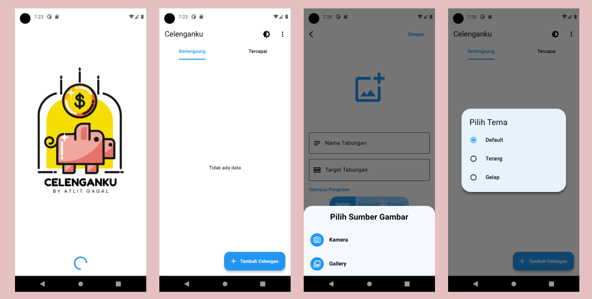
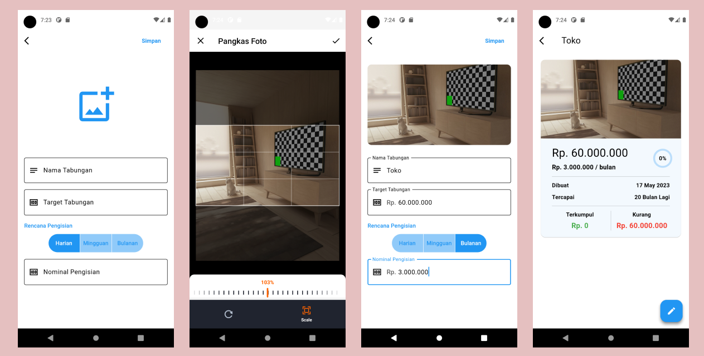
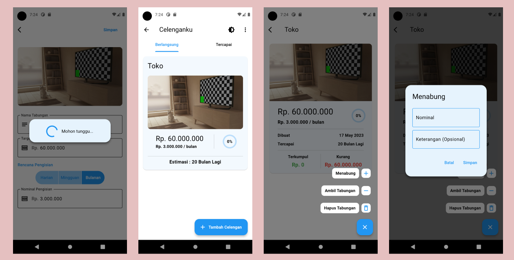
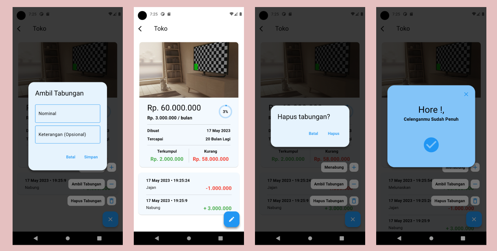
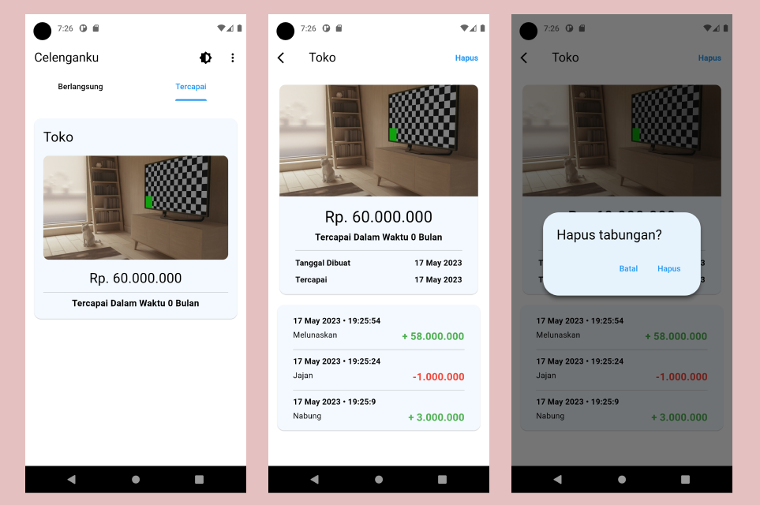
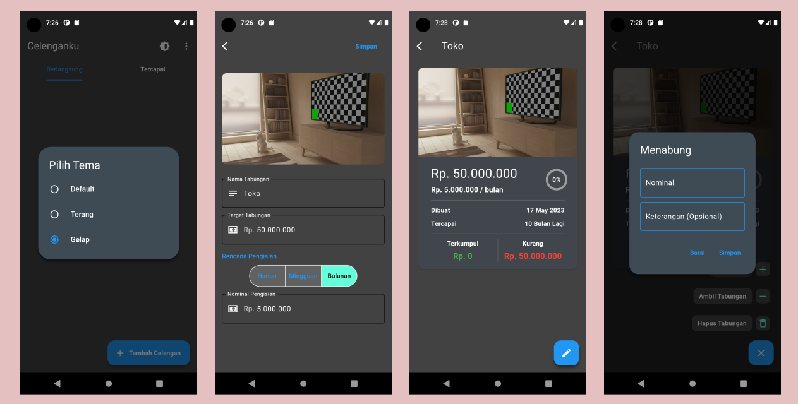
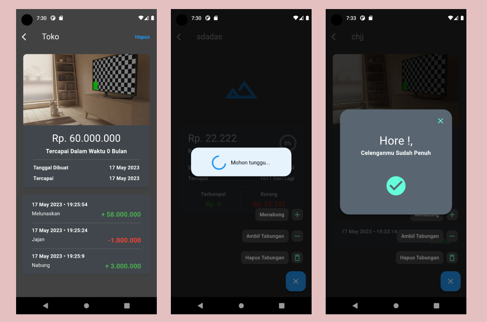

# Aplikasi Celenganku (Bloc State Management) 
Aplikasi untuk mencatat tabungan memiliki fitur mendeteksi berapa lamanya waktu untuk menyelesaikan tabungan, Foto tabungan yang di inginkan, dan tema aplikasi.


## Link Aplikasi
https://drive.google.com/file/d/17cRs1v0Vrcb4thP_85A7-mVOaBYsn1dL/view?usp=share_link

## Getting Started

Pastikan sudah menginstall Git dan Flutter pada environment kalian.

### Prerequisites

- Flutter
  ```sh
  https://docs.flutter.dev/get-started/install
  ```
- Git
  ```sh
  https://git-scm.com/downloads
  ```
  
### Installation

1. Clone the repo
   ```sh
   git clone https://github.com/fadillahnurfaq/celengaku
   ```
2. Install the dependencies
   ```sh
   flutter pub get
   ```
3. Run
   ```sh
   Run Without Debugging On Vs Code
   ```

## Detail Aplikasi

### Tema Terang










### Tema Gelap





## Dependencies
Berikut ini merupakan dependencies yang digunakan dalam project ini:

### State Management
- flutter_bloc: ^8.1.2
- hydrated_bloc: ^9.1.0
- equatable: ^2.0.5

### Local Storage
- hive: ^2.2.3
- hive_flutter: ^1.1.0

### Model Generator
- json_annotation: ^4.8.1
- build_runner: ^2.3.3
- hive_generator: ^2.0.0
- json_serializable: ^6.5.4

### ETC
- dynamic_color: ^1.6.3
- cupertino_icons: ^1.0.2
- flutter_expandable_fab: ^1.7.1
- fluttertoast: ^8.2.1
- image_cropper: ^3.0.3
- image_picker: ^0.8.7+4
- intl: ^0.18.0
- path_provider: ^2.0.15
- uuid: ^3.0.7
- flutter_launcher_icons: ^0.13.1
